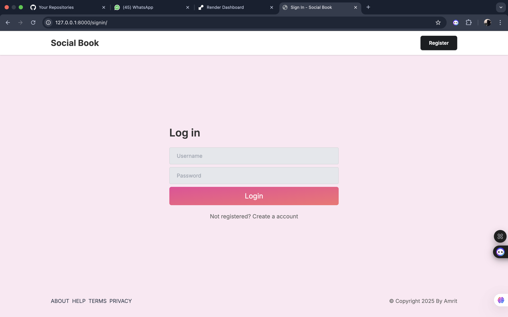
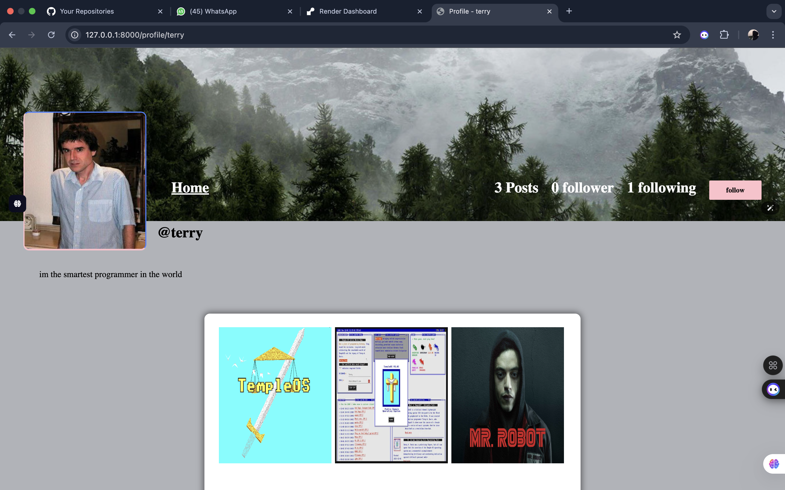

# SocialBook

**SocialBook** is a full-featured social media web application built with Django, Tailwind CSS, and custom styling. It provides a secure and interactive platform for users to share posts, engage with content.

## Features

### 🔐 Authentication
- Secure **login** and **logout** functionality.
- **User registration** with validation.
- Only authenticated users can:
  - Upload posts
  - Like/unlike posts
  - Follow/unfollow users
  - Update profile settings

### 📰 Feed
- View a feed of posts from followed users.
- Like and unlike posts with dynamic updates.

### 📤 Posts
- Upload and share posts with captions.
- Only logged-in users can create posts.

### 👤 Profile Management
- Update profile info including username, bio, and profile picture.
- View your profile or other users' profiles.

### 🤝 Social Features
- Follow and unfollow other users.

## Tech Stack

- **Backend:** Django
- **Frontend:** Tailwind CSS, custom CSS
- **Database:** SQLite (default, or change as needed)
- **Templates:** Django Templates
- **Authentication:** Django's built-in auth system

## Screenshots

### Login Page

  
*User login screen with form validation*

### Post Feed

  
*Main feed showing posts from all users*

### Profile Page

  
*User profile page displaying bio, posts, and profile image*

